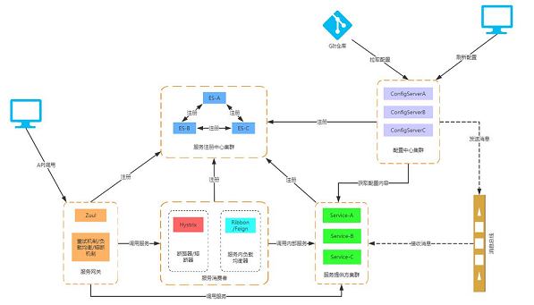

# spring cloud 学习总结

## 写在最前面
  对于学习一门新技术最好的方法就是看书，但是由于spring cloud最近两年才出现，版本更新比较快，所以市场上的学习资料的
版本可能不一样，而且在spring cloud2.0推出后，除了功能上有新的拓展之外，在配置以及依赖上也有很大的变化。有的时候
在网上搜资料会搜不到关键信息，由于在公司实习，所以一般时间并不足够来通过书籍系统的学习，所以在这里建议大家从网上找
系列性的博客跟着后面学习，再有了基础之后再去看书，效果会更好。

## 微服务 vs SOA

微服务架构（MSA）与 面向服务架构（SOA）相似之处，比如，都是面向服务。通常 SOA 意味着大而全的整体单块架构系统(monolithic)
的解决方案。这让设计、开发、测试、发布都增加了难度，其中任何细小的代码变更，都将导致整个系统的需要重新测试，部署。而微服务架构
恰恰把所有服务都打散，设置合理的颗粒度，各个服务间保持低耦合，每个服务都在其完整的生命周期中存活，互相之间影响降到最低。

SOA 需要对整个系统进行规范，而 MSA 每个服务都可以有自己的开发语言、开发方式，灵活性大大提高。

转载：[慕课网:老卫](https://www.imooc.com/article/23880)

## 关于本项目
  本项目对spring cloud的各个功能进行一个学习，在每个独立的项目中都会有单独的文档进行总结以及分享学习中遇到的坑，
该项目有一个地方设计的不是很好，就是所有的子模块都会依赖boot-cloud这个父pom，这样在跑项目的时候，就需要将整个
项目下载下来，在这里注意一下。

## Spring Cloud
  接下来将介绍一下spring cloud的各个模块以及其模块优化，这里除了使用官方的定义来解释之外还会加上自己的理解，
官方的定义虽然很正规，但是有的时候对于初学者来说不是很好理解，之所以采取这样的方式主要是怕学艺不精，解释的不够清楚
，给大家造成误区。在学习之前，大家先熟悉一下Netflix这家公司，这是一家在线影片租赁公司，毕竟这是spring cloud的"大股东"。

### 服务治理（注册/发现） Eureka
> **官方定义**:Eureka是Netflix开源的一款提供服务注册和发现的产品，它提供了完整的Service Registry和Service Discovery实现。
> 也是spring cloud体系中最重要最核心的组件之一。

服务注册和发现是分布式系统中重要的组成部分，或者说是基石也不为过。在分布式环境中，不同服务之间的成功调用，都是
建立在eureka的稳定运行下。eureka客户端和服务端会采取心跳机制来保证服务的正常调用，当出现服务不可用时服务端会
自动移出服务实例。
为什么

### 熔断器 Hystrix
### 熔断监控 Hystrix Dashboard和Turbine
### 配置中心以及进阶版 spring cloud config
### 服务网关 Zuul
### 分布式链路跟踪 Sleuth & Zipkin

